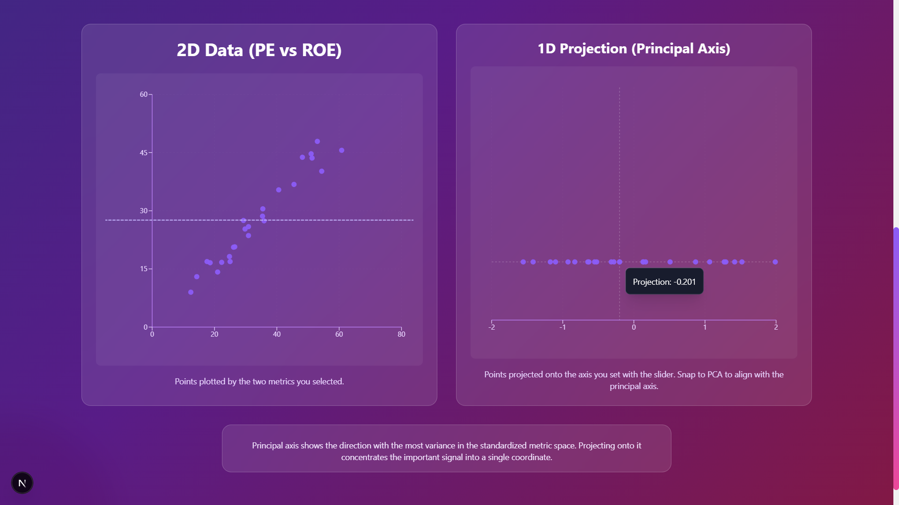
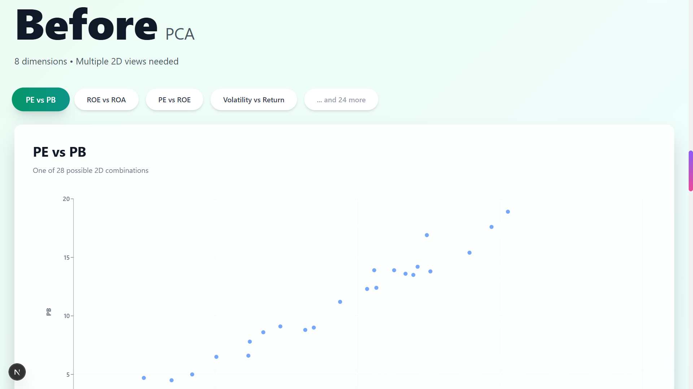
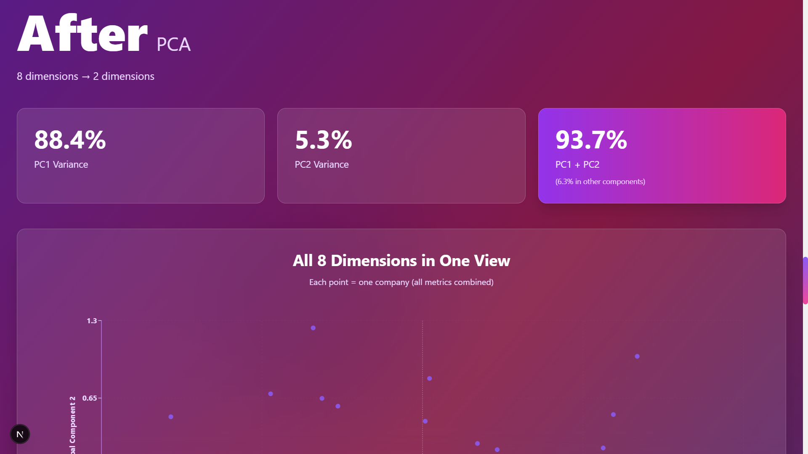
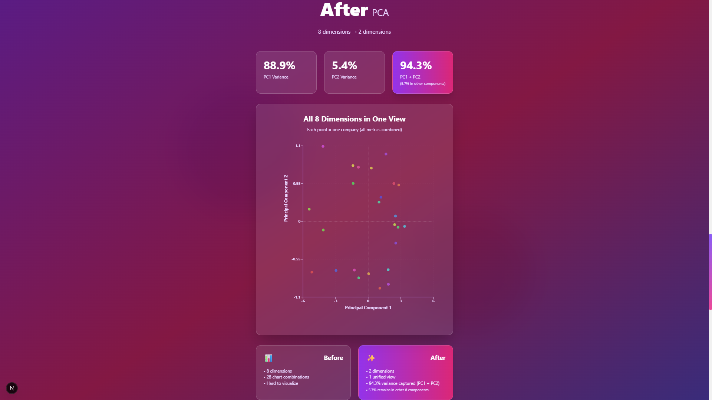

# PCA Explained - A Visual Guide for Finance Professionals

A Next.js 15 web application that visually explains Principal Component Analysis (PCA) in plain English, designed specifically for finance professionals with zero machine learning background.

## Features

- **Hero Section**: Simple analogies explaining PCA concepts
- **Finance Dataset**: Sample dataset with 25 companies and 8 financial metrics
- **Before PCA Visualization**: Multiple 2D scatter plots showing raw data
- **After PCA Visualization**: 2D scatter plot showing compressed data. Includes an interactive demo that lets you rotate the projection axis, snap to the PCA-computed axis, and view the PCA angle in degrees. Datapoints now use a single consistent color and the 1D projection view centers the projection axis for clearer comparison.
- **Closing Summary**: Key takeaways and use cases

## Tech Stack

- Next.js 15 (App Router)
- React 18
- TypeScript
- Tailwind CSS
- Recharts (for visualizations)
- ml-matrix (for PCA implementation)

## Getting Started

1. Install dependencies:
```bash
npm install
```

2. Run the development server:
```bash
npm run dev
```

3. Open [http://localhost:3000](http://localhost:3000) in your browser

## Project Structure

```
├── app/
│   ├── layout.tsx          # Root layout
│   ├── page.tsx            # Main page
│   └── globals.css         # Global styles
├── components/
│   ├── HeroSection.tsx     # Hero section with analogies
│   ├── DatasetSection.tsx  # Dataset display
│   ├── BeforePCASection.tsx # Pre-PCA visualizations
│   ├── AfterPCASection.tsx  # Post-PCA visualization
│   └── ClosingSection.tsx   # Summary section
└── lib/
    ├── financeData.ts      # Finance dataset generator
    └── pca.ts              # PCA implementation
```

##Screenshots
Screen	    Preview
Home Page	
Explanation Page 1	
PCA Flow	
PCA Flow	
Maths	
Maths	
Output Page	

## Key Concepts Explained

- PCA reduces the number of features without deleting meaning
- PCA finds the best direction to view your data using the least variables
- Analogy: Like taking a 3D object photo and storing it in 2D but still understanding it
- Analogy: Like compressing a 100-page book to 2 pages that still tell the same story

## License

MIT

